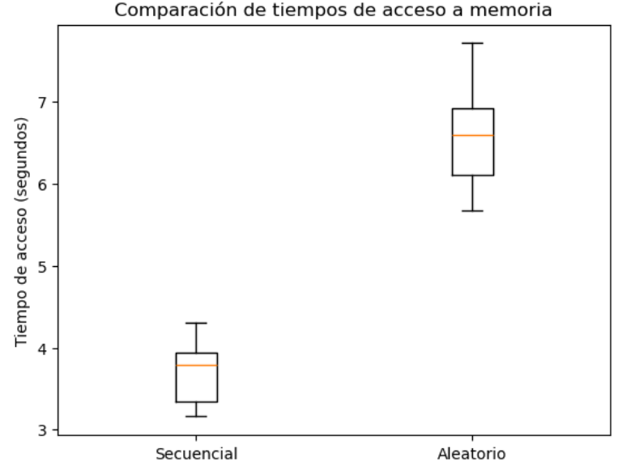

..
   Copyright (c) 2025 Allan Avendaño Sudario
   Licensed under Creative Commons Attribution-ShareAlike 4.0 International License
   SPDX-License-Identifier: CC-BY-SA-4.0

=============
Memoria Caché
=============

.. topic:: Objetivo específico
    :class: objetivo

    Comprender el funcionamiento de la memoria caché en sistemas computacionales, incluyendo su estructura, tipos y estrategias de gestión, para la optimización del rendimiento en el acceso a datos.

Introducción
============

.. centered:: ¿Cuáles criterios usamos para elegir lo que llevamos en nuestra mochila, cartera o bolso?

Contenido
=========

¿Qué es la memoria caché?
-------------------------

Es una porción de memoria de alta velocidad que almacena temporalmente datos e instrucciones a los que el procesador (CPU) accede con frecuencia. 

.. centered:: ¿Cuál es el criterio para almacenar cerca un dato o una instrucción?

Principio de localidad
----------------------

Los programas tienden seguir una regla empírica `90% del tiempo de ejecución utiliza sólo el 10% de su código`, que se traduce en dos tipos de localidad:

.. grid:: 2

    .. grid-item-card::  Localidad temporal 

        Es probable que vuelva a acceder a ese **mismo elemento** un corto tiempo.

    .. grid-item-card::  Localidad espacial

        Es probable que acceda a los **elementos cercanos** en la memoria.

Funcionamiento de la caché
--------------------------

Cuando la CPU necesita leer o escribir datos, verifica en la caché:

* Si los datos están presentes *(cache hit)*, la CPU los utiliza directamente desde la caché. Lo cual, acelera la ejecución. 
* Si los datos no están en la caché *(cache miss)*, la CPU debe recuperarlos de la memoria principal (RAM) o del almacenamiento secundario (disco duro o SSD), lo que lleva más tiempo. Luego, esos datos se almacenan en la caché para futuros accesos. 

El proceso se ilustra en la siguiente figura:

.. figure:: https://www.researchgate.net/profile/Paul-Bilokon/publication/373822770/figure/fig2/AS:11431281187754656@1694402192962/Flowchart-of-a-memory-request-showing-cache-hit-and-miss.ppm
   :figwidth: 50%
   :alt: Flowchart of a memory request showing cache hit and miss.

   Fuente: `C++ Design Patterns for Low-latency Applications Including High-frequency Trading - Scientific Figure on ResearchGate <https://www.researchgate.net/figure/Flowchart-of-a-memory-request-showing-cache-hit-and-miss_fig2_373822770>`_.

Tipos de caché
--------------

El almacenamiento en caché es una tecnología basada en el subsistema de memoria de la computadora, que generalmente se organiza en varios niveles jerárquicos. Los niveles más comunes son:

.. list-table::
   :header-rows: 1
   :widths: 15 55 30

   * - Nivel de Caché
     - Descripción
     - Ejemplos
   * - Caché L1
     - Nivel más básico, más cercano al procesador y el más rápido. Es el que menos capacidad tiene.
     - Pentium G4560: 64 KB (32 KB por núcleo)  
       AMD EPYC 9654: 6 MB
   * - Caché L2
     - Nivel intermedio con equilibrio entre capacidad, cercanía y velocidad.
     - Pentium G4560: 512 KB (256 KB por núcleo)  
       AMD EPYC 9754: 96 MB (1 MB por núcleo)
   * - Caché L3
     - Menos cercana y más lenta que L2, pero con mayor capacidad.
     - Pentium G4560: 3 MB compartidos  
       AMD EPYC 9754: 384 MB (32 MB por chiplet de 8 núcleos)

En la siguiente figura se ilustran los diferentes niveles de caché en relación con la CPU y la memoria principal:

.. figure:: https://miro.medium.com/v2/0*YcgYk__yJxbKTb0p.jpeg
   :figwidth: 50%
   :alt: Tipos de caché 

   Fuente: `Demystifying CPU Caches with Examples <https://mecha-mind.medium.com/demystifying-cpu-caches-with-examples-810534628d71>`_.

**Nota:** Algunos sistemas incluyen caché L4, que es aún más grande y lenta, pero menos común.

Actividad práctica
==================

Utilice el siguiente código en Python para observar el impacto de la localidad en el rendimiento del acceso a memoria.

.. code-block:: python3

    import time
    import numpy as np
    import matplotlib.pyplot as plt 

    # Tamaño del arreglo grande (N=10,000,000) de enteros
    N = 10_000_000
    a = np.zeros(N, dtype=np.int32)

    # Accederemos secuencialmente (alta localidad) a cada elemento del arreglo
    def sequential_access():

        start = time.time()
        s = 0
        for i in range(N):
            s += a[i]
        end = time.time()
        
        return end - start

    # Accederemos aleatoriamente (baja localidad) a cada elemento del arreglo
    def random_access():

        indices = np.random.randint(0, N, N)
        start = time.time()
        s = 0
        for i in indices:
            s += a[i]
        end = time.time()
        
        return end - start

Pruebas y resultados
--------------------

Realice las mediciones para diferente tamaños de muestras y grafique los resultados en un diagrama de cajas.

.. code-block:: python3

    # Número de muestras
    samples = # Ingrese el número de muestras aquí
    
    # Medición de tiempos de acceso secuencial
    seq_times = [sequential_access() for _ in range(samples)]
    rand_times = [random_access() for _ in range(samples)]

    # Graficar resultados
    plt.boxplot([seq_times, rand_times], labels=['Secuencial', 'Aleatorio'])
    plt.ylabel('Tiempo de acceso (segundos)')
    plt.title('Comparación de tiempos de acceso a memoria')
    plt.show()

En el gráfico resultante, podemos observar la diferencia significativa en los tiempos de acceso entre los dos métodos.

.. dropdown:: Conclusiones

    - La memoria caché mejora significativamente el rendimiento del acceso a datos cuando hay alta localidad.
    - Los accesos aleatorios resultan en más fallos de caché, lo que ralentiza la ejecución.
    - La optimización del acceso a datos es crucial para el rendimiento de las aplicaciones.

Actividad autónoma
==================

1. Revise el sitio de `Información general sobre el almacenamiento en caché <https://aws.amazon.com/es/caching/>`_.
2. Seleccione un servicio de almacenamiento en caché ofrecido por AWS (por ejemplo, Amazon ElastiCache).
3. Elabore un mapa conceptual resumiendo las características, beneficios y casos de uso del servicio seleccionado.
4. Presente sus conclusiones en el foro de discusión de la semana.

Referencias
===========

* Provost, G. (2024). What Is Cache and How Does It Work? Retrieved from https://computer.howstuffworks.com/cache.htm
* Ruz, J. J. (2012). Estructura de Computadores, Facultad de Informática, UCM. Retrieved from https://www.fdi.ucm.es/profesor/jjruz/web2/temas/ec6.pdf#page=4.18
* GeeksforGeeks. (2025). Types of Cache. Retrieved from https://www-geeksforgeeks-org.translate.goog/system-design/types-of-cache/
* Ros, por I. (2024). Memoria caché: qué es y qué diferencias hay entre los tipos L1, L2, L3 y L4. Retrieved from https://www.muycomputer.com/2024/07/03/memoria-cache-que-es-y-que-diferencias-hay-entre-los-tipos-l1-l2-y-l3/
* Castillo, J. A. (2022). Qué es la memoria caché L1, L2 y L3 y cómo funciona. Retrieved from https://www.profesionalreview.com/2019/05/02/memoria-cache-l1-l2-y-l3/
* C++ Design Patterns for Low-latency Applications Including High-frequency Trading - Scientific Figure on ResearchGate. Available from: https://www.researchgate.net/figure/Flowchart-of-a-memory-request-showing-cache-hit-and-miss_fig2_373822770 [accessed 1 Dec 2025]
* Demystifying CPU Caches with Examples (2023). Retrieved from https://mecha-mind.medium.com/demystifying-cpu-caches-with-examples-810534628d71